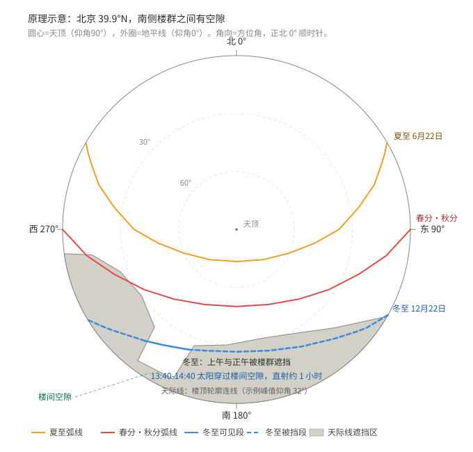
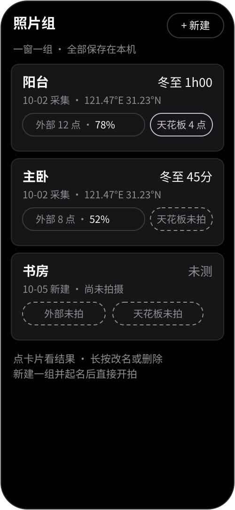
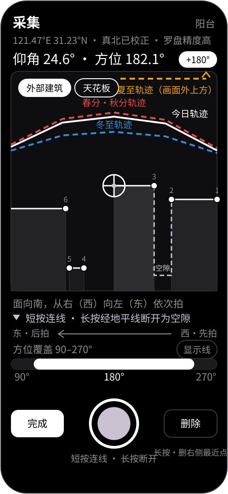
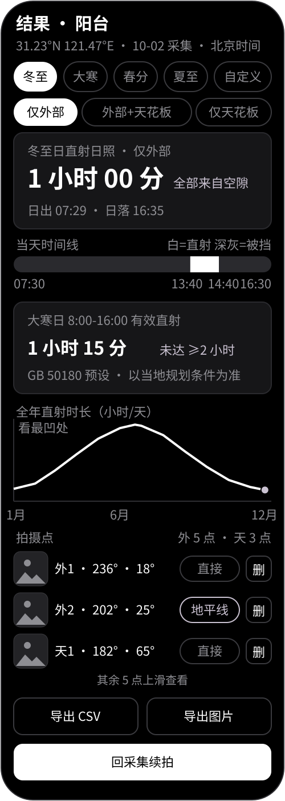

# 七日 D7 · 日照时间计算器

买房前，自己量日照。

站在你看中的那扇窗前，打开 app，用相机对准对面楼房的楼顶轮廓，逐个拐点按快门。手机记下每个点的仰角和方位角，把这些点连成天际线，再算出这个位置全年每一天的直射日照时长。

不需要卷尺，不需要测距仪，不需要知道对面楼多高、间距多少。看现房和二手房尤其顺手。

> 四期开发计划（算法原型、测量端、计算与可视化、打磨发布）已全部落地；本文件说明原理与操作方式。

## 原理

三句话讲完。

1. 太阳每天在天上走的弧线，只由纬度和日期决定。北京冬至正午太阳离地平线约 27 度，夏至约 74 度。这条弧线天文上早已算准，误差远小于手机传感器的误差。
2. 楼挡光，只看角度。一座 100 米的楼在 500 米外，和一堵 10 米的墙在 50 米外，在你眼里占同一块天，挡阳光的效果一样。所以买房人要的是量角度的工具，测距反而用不上。
3. 手机能量角度。姿态传感器以重力为基准，仰角误差约 1 度。指南针加上磁偏角校正，方位角误差约 2 到 4 度。相机在这里只是瞄准镜：十字线对准楼顶拐点，按快门，这个点的角度就记下来了。

点连成天际线后，app 一分钟一分钟地算太阳位置。太阳高过天际线，这一分钟就算有直射。把一天里有直射的分钟加起来，就是当天的日照时长。换日期重算，得到全年曲线。

方位角从正北顺时针数，0 到 360 度，正南是 180 度。仰角是抬头角度，地平线 0 度，天顶 90 度。

楼与楼之间常常有空隙。拍到一栋楼的尾角时用长按封楼：app 从该点竖直降到地平线，沿地平线走到下一点的方向，再竖直升上去，空隙一次成形。上图里南侧两栋楼之间有一条空隙，冬至正午前后太阳被挡，午后 13:40 到 14:40 却能从空隙里穿过来，整整多出一小时。所以空隙两边都要落点；空隙里立着矮墙或大树，同样用短按把它连进来，别让它悄悄偷走这一小时。

### 南半球与回归线

太阳直射点一年在南北回归线之间来回，所以「挡光的楼在南边」只对北回归线以北成立。

北回归线以北，涵盖中国绝大多数城市，正午太阳永远在南边，拍南侧的楼。南回归线以南，比如悉尼、奥克兰、布宜诺斯艾利斯，正午太阳永远在北边，拍北侧的楼。

住在两条回归线之间，比如海口、三亚、新加坡，情况是混合的：冬天正午太阳在南，夏天会跑到北边。想算全年，就把南北两侧都拍了，尽量凑一圈。app 会按你的纬度提示重点方向，也会提醒哪些角度还没覆盖。

还有一点容易忽略：就算在北京，夏天太阳也从东北升起、西北落下。只拍南侧的话，夏至清晨和傍晚的结果算不准。好在买房人最关心冬天。冬季太阳整天待在南侧半圆里，北京冬至日出方位约 120 度、日落约 240 度。把南侧连同部分东西侧拍全，冬季结果就是可靠的。

## 怎么用

1. 站位与建组。站在你最关心的窗或阳台前，手机尽量伸到窗洞中间。按窗建组：一扇窗就是一组，新建组时起个名字（例如“阳台”），填入经纬度或点「用 GPS 定位」——对话框会实时显示这台设备的定位能力与精度（GPS、网络定位、系统融合各自是否可用），定位不可用时手动输入即可。换窗、换层分别建组。角度跟着站位走，测哪儿算哪儿。期房没法测，只服务现房和二手房。
2. 校准。现场把手机在空中画几个 8 字，校准指南针。阳台和窗边的钢筋会干扰罗盘，这步别省。app 会显示当前方位的估计精度。
3. 采集。面向南侧，从右（西）向左（东）依次拍所见建筑物的轮廓顶点（南半球面向北时镜像：从右（东）向左（西）；总之从一端拍到另一端、别来回跳）。这样拍完后在相册里从右往左翻，照片由旧到新正好顺着拍摄方向。快门两种按法：短按把新点与上一点直线相连；长按把上一点视为当前楼的终点——app 从上一点竖直降到地平线，沿地平线走到新点所在方向，再竖直升到新点，空隙一次成形。空隙里若有矮墙、大树或低楼挡光，别用长按跳过去，用短按把它的顶点也连进来。照片默认每拍一张自动保存，想只留角度不留照片就点读数行里 `+180°` 左边的「不拍照」药丸；单拍即可，不连拍。

每组照片分两个区：外部建筑区拍对面楼，天花板区拍自家窗框上沿。取景器左上的分区 chip 在两者之间切换，两区点序各自独立，照片按区存放。切到天花板区后，沿窗框上沿同样从右向左拍（右上角→上沿中点→左上角，横梁或吊顶有起伏处加拍拐点），两侧竖框拍到侧沿即可，窗台下沿默认不挡、不用管。天花板区只支持短按连线，不支持长按——窗框连续无断隙，长按快门无动作。
4. 改错与收工。拍错不用重来：右下删除键只删十字线右边离当前朝向最近的一个点，不动左边的点；必须长按才执行，按住不放一次最多删 1 个点；短按不删任何东西，只弹一句「长按删右侧最近点」。左下完成键确认收工。查漏看覆盖条（只计南半圆 90–270°，南半球镜像为北半圆）；东西两侧有围墙、大树或矮楼的顺手补拍，低楼层尤其注意近处遮挡。镜头别压到地平线以下：那样拍不到楼，只会把"瞄错地面"记成一条贴地的墙。
5. 续拍与改点。从结果页回到采集，可对同一组继续拍：先用 chip 选定分区，新点按该区原序续接。已拍点的修改放在结果页的点列区：删任意一个点，或把某点与右边相邻点（拍摄序里的前一个点，点列上一行）之间的连线在“直接连线 / 走地平线”两种模式之间切换（天花板点只有直接连线）。
6. 读结果。

采集页与结果页的左上角各有一支返回箭头，回到照片组列表——有些手机没有底部返回键（手势导航，或把导航条藏起来），这两页就靠它退出来。照片组页右上角「文A」旁边是一枚太阳图标键，管屏幕是否常亮，默认常亮：举着手机连着按快门、对着时间轴比对时，屏一黑就得重新解锁。开=琥珀、关=月灰，与采集页的手电筒、对焦两键同一套开关语义。**会被记住的设置**：屏幕是否常亮、九条显示线的显隐、「不拍照」、`+180°`、界面语言。它们存在本机的偏好里，下次打开还是上次的选择，换组、换窗也不受影响。**不记的两项**：手电筒沿用进入采集页时手机当前灯的状态，自动对焦每次默认打开——这两个属于当场看着调的量，不该跨页面继承。

所有组列在照片组管理屏，一组一卡片：组名、冬至结论，以及外部区点数覆盖率与天花板区状态（已拍点数或未拍虚框）。点卡片进结果，长按改名、删除或导出；右上新建一组并起名后直接开拍。

取景器里叠着实时参考线：蓝色虚线是冬至那天的太阳轨迹，一年里最低的一条。红色虚线是春分和秋分，介于两者之间。橙色虚线是夏至，最高，多数时候在画面外，抬高手机才能看到。白色实线是今日的太阳轨迹，当天校验用。取景器左上的分区 chip 在“外部建筑 / 天花板”之间切换当前拍摄区。地平线与铅垂线是灰色短虚线，默认隐藏，需要时在显示设置里打开。举到哪个方位，就画落在视场里的那一段。十字线落在冬至线以下，说明这个点整个冬天都挡不住太阳，可以不用管它。高出夏至线，则全年全天遮挡。低纬度正午轨迹贴近天顶的那一段画不准，app 会隐去，改用文字提示。瞄准角度超出这两条边界时，屏幕会实时给出提醒。精度药丸一行右侧显示滚转角（手机左右倾斜角，不是航向；正值=机顶向右倒），取景时顺手校平。

地平线以下铺一层浅浅的土色，像飞机姿态仪里的地面。手机举太高、镜头压到地面时，这条土色会涨上来提醒你——继续往下按快门会被拒绝，不记录这个点。原因很实在：低于地平线的读数若照旧存下来，会被压成 0 度，变成一条"贴地的矮墙"，而数据里看不出这个点本来瞄错了，事后也无法复原。取景器下方同时亮起红条提示你把镜头抬回地平线以上。

方向读数旁有 `+180°` 小按钮：后摄朝向与姿态传感器的机身朝向读数天然差约 180°（竖持拍照时前者指向楼、后者指向人），所以默认叠加 +180° 并以填充态显示；若你横持、外接镜头或发现指向反了，点一下即取消/恢复。不需要连拍，单拍逐点确认最稳。

取景器直接画出已拍点的连线：白色实线是短按的实测段，月灰虚线是长按展开的经地平线推断段，一眼看出哪里连了、哪里断了。拍摄方向箭头放在取景器下方（西·先拍 → 东·后拍），不挡画面中心。

覆盖条旁“显示线”控制各参考线的显隐：默认显示夏至、冬至、春秋分、今日轨迹与拍摄点连线，以及地平线以下的地面层；地平线与铅垂线默认隐藏，需要时再打开。地面层之上还有一项“楼体遮挡区”，默认打开，天际线以下到地平线之间会填一层很淡的白，用来一眼看出楼挡住的是哪一片；切到天花板区它改填在窗框折线**以上**——窗框挡的是上面那片天，太阳要低于框沿才照得进来。它只画你已经拍过的方位，没拍的区域不填——那片是未知，不是"不挡"。

## 结果怎么读

结果页有七样东西。

覆盖率提示。大数字下面那行字，写着主半圆扫到了多少：不到 60% 显示红色"可能没拍全"，60% 到 85% 显示黄色"建议补拍两端"，扫满了显示烟灰色。这行值得先看一眼再决定信不信那个时长——没拍到的方位按开阔算，所以拍得越少，结论越偏向"有太阳"。只拍了一两个点时直接提示"拍摄点太少，结果多半偏乐观"。切到"仅天花板"档时这行会改看天花板区自己的覆盖率，并把方向掉个个儿说"偏保守"——那一档没拍到的方位按全遮挡算，拍得越少结论越偏向"没太阳"。覆盖条只在采集页有，所以这是结果页的最后一道告知。

计算对象。日期药丸下方三档切换：仅外部（默认，只算对面楼的遮挡）、外部+天花板（同时计入自家窗框的裁剪，交房验光用这一档）、仅天花板（只看窗框本身让进多少光，适合先验房型再看楼）。判定规则：外部区未拍到的方位视为开阔；天花板区未拍到的方位视为墙体全遮挡。某一区整区未拍时按同一规则退化：外部区未拍则全周开阔，天花板区未拍则全周遮挡，所以没拍天花板之前，涉及天花板的两个档位会置灰并提示先拍天花板。

全年曲线。横轴一年 365 天，纵轴每天的直射时长。冬低夏高是正常的，重点看冬天最凹的那一段。

关键日期。冬至日和大寒日单独列出，可以任选日期重算。中国大陆的居住区国标 GB 50180-2018 按「标准日 + 有效时间带」考核住宅日照：Ⅰ、Ⅱ、Ⅲ、Ⅶ 气候区大寒日 8 时至 16 时不少于 2 小时，城区常住人口不足 50 万的城市 3 小时，Ⅳ 气候区大寒日 8 时至 16 时不少于 3 小时，Ⅴ、Ⅵ 气候区考核冬至日 9 时至 15 时不少于 1 小时，都按当地真太阳时计，计算起点是底层窗台面。app 内置这些预设并只报窗口内累计分钟数，不做自动达标判定——各地考核标准不同，请拿测量数字对照当地规划条件。其他国家和地区的用户按同样思路自选日期。结果页那句国标说明只在中文界面出现：这套气候区划出了中国大陆没有对照意义，翻译过去只会把一句「本地不适用」的标准说成通用结论。

时间线。一条从日出到日落的横条，白色是直射，深灰是被楼挡住的白天时段。从楼间空隙穿进来的太阳也是直射色。几点有太阳、几点没太阳，一眼看完。

手表时间。app 用 GPS 经度和均时差换算太阳位置，输出你所在时区的钟表时间。乌鲁木齐的日照会正确落在北京时间 14 点附近，不会错算成中午 12 点。

点列。每拍一点一行：分区标记（外 / 天）、序号、方位、仰角、照片缩略图，以及该点与右边相邻点（拍摄序里的前一个点）的连接模式（直接连线 / 走地平线，可切换；天花板点只有直接连线）与删除。点缩略图会弹出整屏大图（黑底、按比例缩到屏幕内，点任意处或返回键关闭），照片正中叠着一个准星，就是拍照时取景器十字线所指的那一点，用来复核楼顶拐点对得准不准。删这一点时，它名下的那张照片一并删掉——与采集页长按删点同一套语义。回采集续拍之前，先在这里把错点改完。

## 准确度与限制

诚实列在这里：

- 方位角误差 2 到 4 度，折算成时间约 10 到 20 分钟。判断「有没有两小时」够用，打官司不够。
- 仰角误差约 1 度，比方位角可靠。挡不挡光主要由仰角决定，这是好消息。
- 树没算。落叶树冬天只剩枝干，仍然挡一部分光，本工具按无树计算，结果偏乐观。常绿树请当作楼来拍。
- 只算天文直射，不算云、雾、玻璃的衰减。
- 站位必须是要考察的那扇窗。同一栋楼里换一扇窗、换一层，角度都会变，请分别测量、分别保存。
- 不能替代开发商的官方日照分析报告。这是你自己的独立核算，用来交叉验证销售话术、比较不同房源。

## 隐私

app 不申请网络权限。照片、角度、位置全在手机本地，随时导出 CSV 和图片，随时删除。系统自动备份已关闭（`allowBackup=false`），数据不会被上传到云端。上面那些设置也只存在本机偏好里，不参与任何同步。

## 界面与配色

app 名为「七日」，英文名 D7。图标源图是根目录的 `城市日照十字瞄准图标.png`：黑底、白十字线、灰白楼体、金色太阳（另有灵感图与配色基准 `太阳映照下的城市瞄准图标.png`、`配色基准.jpg` 作为设计资料保留在本地、不入库）。

配色基准取自`配色基准.jpg`主角色的黑白造型（漆黑服饰与背景、雾白文字与高光、灰紫瞳孔过渡）：

- 背景黑 `#000000`：手机框、采集 / 结果页底色
- 卡片炭灰 `#161618` / `#1C1C1E`：信息卡、覆盖条底、时间线被挡段
- 前景白 `#FFFFFF`：正文、十字线、覆盖已达段、直射段、全年曲线、今日轨迹实线
- 月灰 `#CAC2D1`：快门中心圆填充、经地平线推断段虚线、次强调（空隙来源、瞄准点状态）
- 烟灰 `#8E8E93`：次要文字、未选中日期药丸、坐标轴、地平线与铅垂线
- 地面土色 `#8A6A3D`：地平线以下的地面层（半透明），仿飞机姿态仪
- 瞄准警告 `#FF453A`：镜头压到地平线以下时的红条与常驻提示
- 精度 / 覆盖率四态：高绿 `#34C759` / 中黄 `#EF9F27` / 低红 `#E24B4A` / 未知灰 `#8E8E93`
- 描边 `#2E2E32` / `#3A3A3E`：卡片与按钮描边
- 轨迹三色（虚线）：冬至蓝 `#378ADD`、春秋分红 `#E24B4A`、夏至橙 `#EF9F27`
- 方向 `+180°` 药丸：默认填充态（已叠加），点按切换；位于方位读数旁
- 拍摄点连线：白色实线（实测段）+ 月灰虚线（经地平线推断段），默认显示
- 遮挡填充：极淡白（alpha 26），只填已拍方位，默认打开
- “显示线”开关：默认显示太阳轨迹线、拍摄点连线、地面层与遮挡填充；地平线与铅垂线默认隐藏

采集页底部一行五个控件：完成键、手电筒、快门、对焦键、删除键。手电筒与对焦键是纯图形无文字，无闪光灯的机型上电筒键自动隐藏；对焦默认打开、每 3 秒补一次，短按立刻对焦、长按开关自动对焦。照片默认保存，想只记角度不留照片就点读数行里的「不拍照」药丸；单拍即可，不做连拍。

关于黑底与室外强光：诚实地说，纯黑在正午直射下并不是最亮的方案，同亮度下白底黑字的环境光对比更高。但保留黑底有三条理由：一是取景器本身是亮场景（天空/楼面），黑色边框收光、让视线留在画面里，白色边框反而晃眼；二是 OLED 黑像素不发光，野外连续测量更省电、机身更少发热；三是与图标（黑底白十字）一致，品牌连贯。代价是次要灰字在强光下会先看不清，所以现场关键信息（仰角、方位、提示、快门）一律用白色大字与高饱和轨迹色，只把 GPS、刻度这类可后查的信息放灰色；实测若仍看不清，优先加系统亮度跟随与粗线宽，而不是换白底。

## 技术要点（写给开发者）

- 太阳位置用 NOAA 简化天文公式，与高精度星历对拍误差小于 0.02 度，远小于传感器误差，不是瓶颈。
- 姿态用 Android 旋转矢量传感器，由加速度计、陀螺仪、磁力计融合输出。仰角以重力为基准，不经罗盘，所以最关键的量最稳。方位取后摄视轴方向（竖持时约为机身读数 +180°，故默认叠加，用户可点按 `+180°` 取消/恢复），并经磁偏角校正到真北。
- 磁偏角直接用 Android 的 GeomagneticField.getDeclination()，输入 GPS 经纬度（加高度与时间更准）即得当地磁偏角，由它换算真北。该 API 内置世界地磁模型，无需自带系数表、无需联网。现场仍需画 8 字校准指南针，因为偏角只能纠系统偏差，纠不了阳台钢筋的局部干扰。
- 组存两个有序点列：ext[{az,el,gapAfter}] 与 ceil[{az,el}]（无 gapAfter，点序两区各自独立）。长按的空隙展开为三段推断：上点竖直到地平线、沿地平线走到新点方向、竖直到新点；求值时推断段取地平线、实测段按方位插值，重叠方位取最大仰角（遮挡取高者），所以换向或偶尔回拍不会算错。照片同步写入 EXIF。逐分钟判定：仅外部档要求太阳高于外部天际线（所拍区间外视为开阔）；外部+天花板档另要求太阳低于天花板上沿（所拍区间外视为墙体）；仅天花板档只做后者。任一区点列为空则该区恒通过。计算时逐分钟采样判定太阳可见性，累加得到时长。采集页删除键长按删去十字线右边最近的一点及其连接段（含推断三段），一次只删 1 点，不动左边的点；结果页点列区可删任意点，并切换某点与右边相邻点（拍摄序前一点、点列上一行）之间“直接连线 / 走地平线”模式。
- 取景器里的回归线参考弧用方位角、仰角到屏幕像素的平面投影绘制，在视场中心约 40 度内保持精确，近天顶段自动裁剪。弧线只由纬度和日期决定，手机姿态只决定哪一段出现在屏幕上，所以采样按赤纬缓存在叠加层里、定位更新时重算一次就够；采样取几何高度角（不含大气折射），与天际线判定基准一致。

## 许可与状态

四期计划（算法原型、测量端、计算与可视化、打磨发布）已全部实现：算法有单元测试，界面有仪器测试，可自行构建安装。英文说明见 [README.en.md](README.en.md)。
